# Tab Collector

Tab Collector is a Microsoft Edge Manifest V3 extension for saving tabs,
browser tab groups, and whole windows into a collector page that is designed to
be searchable, editable, and easy to restore.

## What it does

- Saves the current tab, the active Edge tab group, highlighted tabs, or the
  current window.
- Opens a popup that acts like a compact control center for save actions.
- Stores saved groups with titles, notes, pin/lock/archive state, and search.
- Restores tabs into the current window or a new window.
- Supports excluded domains, duplicate handling, pinned-tab rules, and
  memory-saving restore behavior.
- Supports Griffin plus imported Cobalt, Ember, and Forest palettes. Griffin
  currently supports system, light, and dark appearance modes.
- Exports one group or all groups as themed HTML, JSON, or comma-delimited
  data.
- Uses a Griffin Software Studios visual treatment for the options page and the
  collector page.

## Product previews

These are repository-managed previews for the current UI direction. They are
illustrative and should be replaced with live browser screenshots before store
submission.

### Dark mode

| Collector | Popup | Options |
| --- | --- | --- |
| 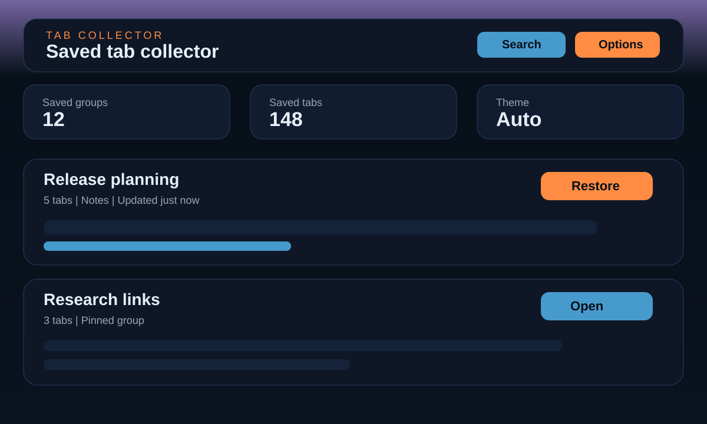 | 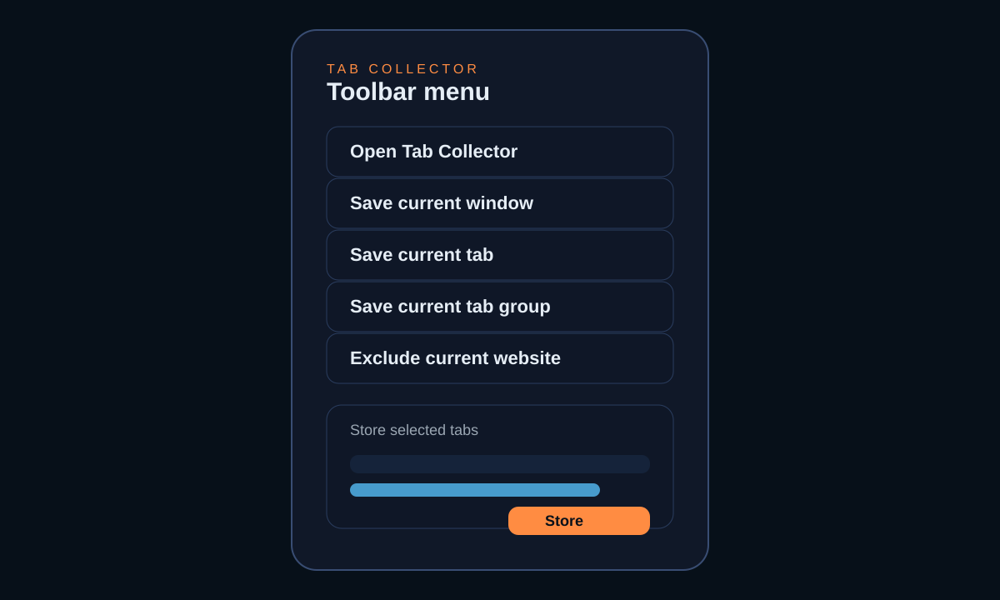 | 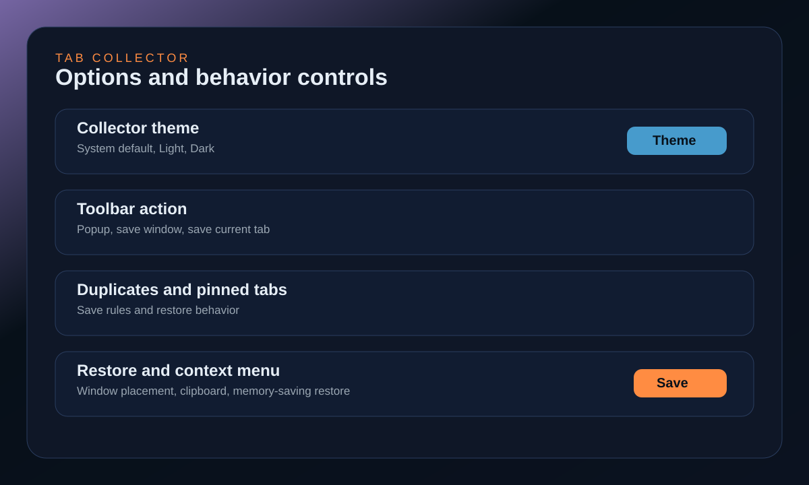 |

### Light mode

| Collector | Popup | Options |
| --- | --- | --- |
| 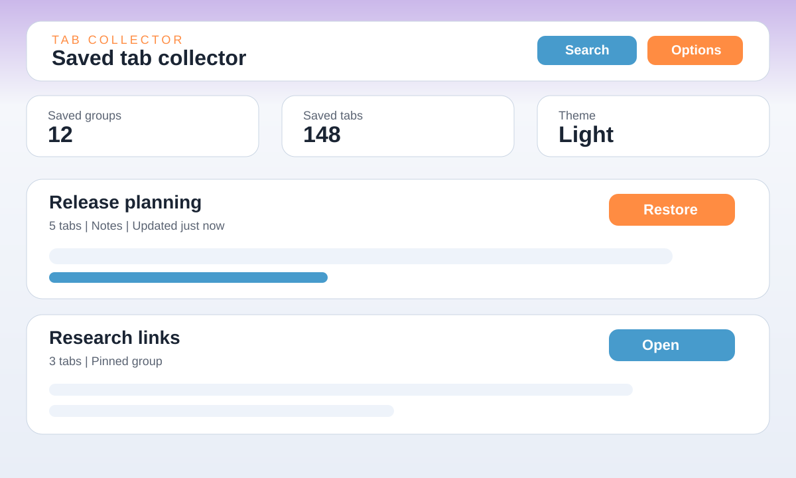 | 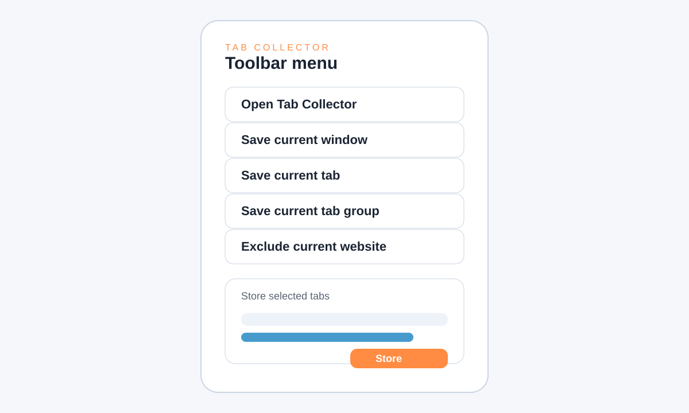 | 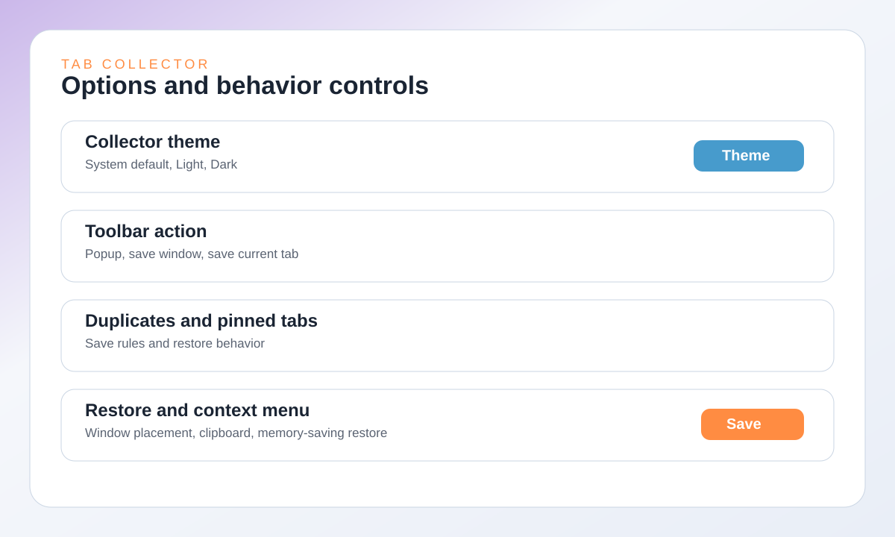 |

## Edge validation evidence

These are real Edge-backed screenshots captured from an isolated unpacked-extension
session. They are repo-local proof artifacts under `tests/` and are excluded
from release packaging.

- [Latest Edge release checklist](tests/manual/EDGE_RELEASE_CHECKLIST.md)

| Collector (Desktop) | Collector (Tablet) | Collector (Mobile) |
| --- | --- | --- |
| 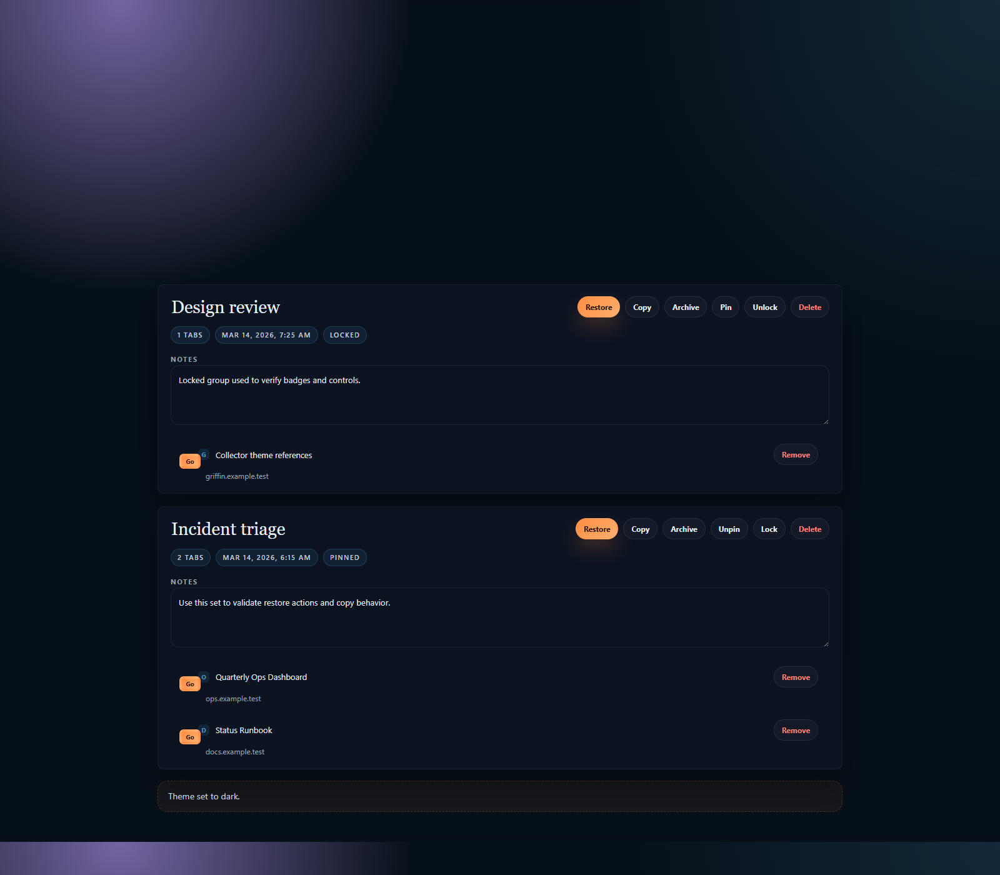 | 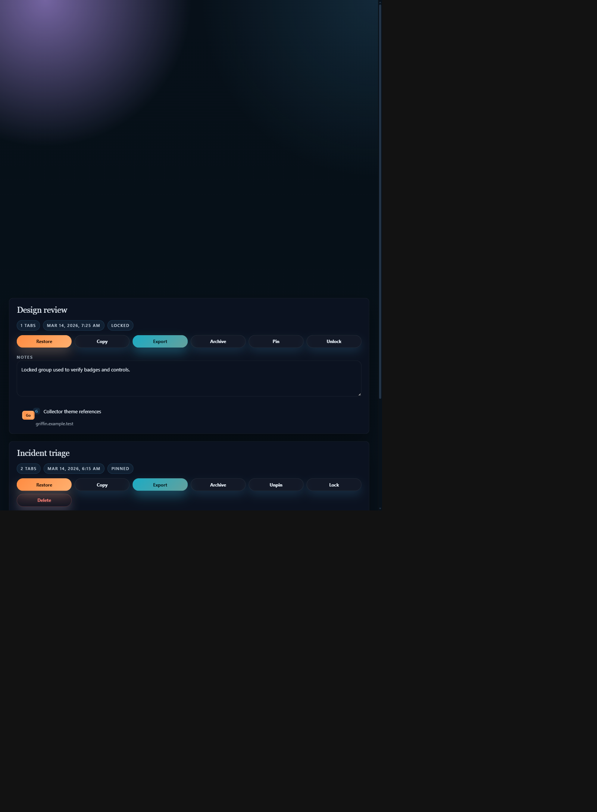 | 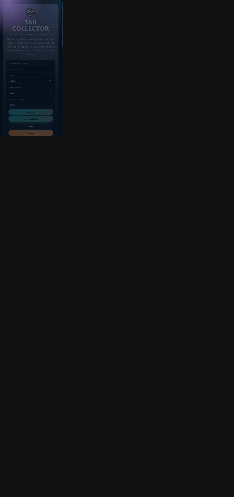 |

| Popup | Options |
| --- | --- |
| 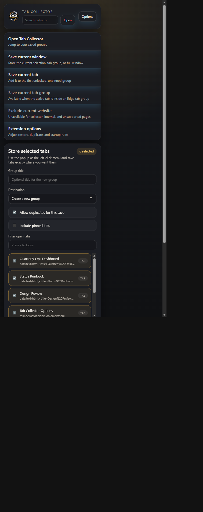 | 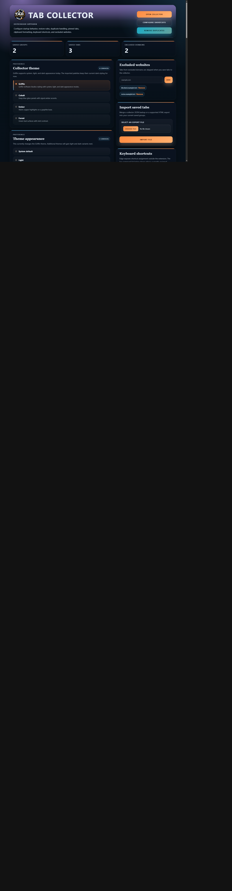 |

## Core surfaces

- `popup.html`
  quick actions, selected-tab save controls, and recent-group shortcuts
- `collector.html`
  saved-tab management, search, notes, and restore actions
- `options.html`
  extension behavior and save/restore settings
- `background.js`
  save, restore, routing, commands, omnibox, and context-menu behavior
- `shared.js`
  shared state shape, defaults, and normalization helpers

## Current workflow summary

### Save

- Toolbar popup for exact tab selection
- Page context menu for quick save actions
- Keyboard command for opening the collector
- Keyboard command for saving the current tab
- Omnibox keyword for jumping into the collector search

### Organize

- Rename groups
- Add notes
- Review and selectively remove duplicates
- Pin, lock, archive, and delete saved groups
- Export one group or every group
- Exclude noisy domains from future saves

### Restore

- Restore one tab or a whole group
- Choose whether tabs are removed, kept, or archived after restore
- Choose whether whole-group restore opens in a new window or the current one

## Browser/platform notes

- The extension currently targets Microsoft Edge on the Chromium extension
  platform.
- Native tab-strip and tab-group-header context menus are not exposed to
  extensions through the documented Chromium API surface, so right-click save
  actions are implemented through the page context menu and the popup instead.

## Load in Edge

1. Open `edge://extensions`.
2. Enable `Developer mode`.
3. Click `Load unpacked`.
4. Select this folder: `s:\Dev\Tabs`.

## Package a zip

From `s:\Dev\Tabs`:

```powershell
.\package.ps1
```

That creates a zip in `dist\` using the manifest name and version. You can also
override the output folder or zip name:

```powershell
.\package.ps1 -OutputDirectory releases -PackageName tabs-extension
```

## Run tests

From `s:\Dev\Tabs`:

```powershell
npm test
```

The current suite covers:

- shared state normalization and helper behavior
- manifest, popup, and background contract alignment
- save action registry integrity across extension surfaces
- extracted background and collector behavior logic

To refresh the Edge-backed release evidence:

```powershell
npm run evidence:edge
```

## Documentation map

- [Docs registry](docs/README.md)
- [Variable normalization registry](docs/VARIABLE_NORMALIZATION_REGISTRY.md)
- [Function reference](docs/FUNCTION_REFERENCE.md)
- [Menu options reference](docs/MENU_OPTIONS_REFERENCE.md)
- [Documentation connection rubric](docs/DOCUMENTATION_CONNECTION_RUBRIC.md)
- [Engineering notes](docs/ENGINEERING_NOTES.md)
- [State of affairs](docs/STATE_OF_AFFAIRS.md)
- [AI integration records](security/ai-integrations/README.md)

## Repository status

This repo has moved beyond a bare scaffold and now has:

- a working collector page
- a styled popup and options page
- page-context save actions
- save support for the active Edge tab group
- a lightweight automated and Edge-evidence test suite
- a first-pass documentation and governance overlay

The next major improvement areas are light/dark variants for the imported
themes, deeper collector interaction coverage, and remaining store-release
hardening work.
