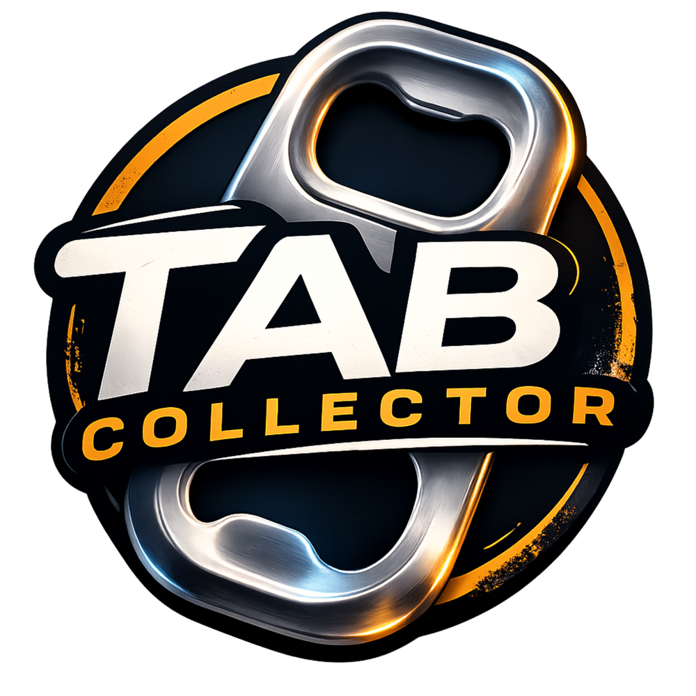

# Tab Collector - Brand Media Inventory

This folder contains the Tab Collector brand assets used by the extension UI, manifest icons, and packaging/export workflows.

## Asset catalog

| File | Preview | Format | Dimensions | Typical usage |
| --- | --- | --- | --- | --- |
| `tab-collector-64.png` |  | PNG | `64x64` | Primary small icon source for browser/favicon surfaces. Currently referenced by `manifest.json` (`16`, `32`, `48`) and page favicon links in `popup.html`, `options.html`, and `collector.html`. |
| `tab-collector-128.png` |  | PNG | `128x128` | Primary medium icon source for extension/app surfaces. Currently referenced by `manifest.json` (`128`), action default icon (`128`), popup header logo, options hero logo, and collector hero logo. |
| `tab-collector-256.png` |  | PNG | `256x256` | High-resolution square icon for docs, store prep, and future UI surfaces that need denser raster output. Not currently wired to runtime HTML/manifest. |
| `tab-collector-512.png` |  | PNG | `512x512` | Highest packaged square PNG for store assets, screenshots, and downscaled derivatives. Not currently wired to runtime HTML/manifest. |
| `tab-collector-master-1000.png` |  | PNG | `1000x1000` | Master raster source for generating additional icon sizes and marketing/media derivatives. |
| `tab-collector-exact.svg` |  | SVG (embedded image) | `1000x1000` (`viewBox`) | Exact-match vector wrapper that preserves the uploaded art treatment (including metallic/gradient shading) for scalable docs/export media. |

## Current runtime references

- `manifest.json`
  - `icons.16/32/48 -> assets/brand/tab-collector-64.png`
  - `icons.128 -> assets/brand/tab-collector-128.png`
  - `action.default_icon.16/32/48 -> assets/brand/tab-collector-64.png`
  - `action.default_icon.128 -> assets/brand/tab-collector-128.png`
- `popup.html`, `options.html`, `collector.html`
  - favicon link -> `assets/brand/tab-collector-64.png`
- `popup.html`, `options.html`, `collector.js`
  - header/hero logo -> `assets/brand/tab-collector-128.png`

## Selection guidance

- Use `64` and `128` for extension runtime surfaces where the manifest and UI currently expect those sizes.
- Use `256` and `512` for high-density docs/store assets when direct SVG is not desired.
- Use `tab-collector-master-1000.png` or `tab-collector-exact.svg` as the source of truth for generating new derivatives.
